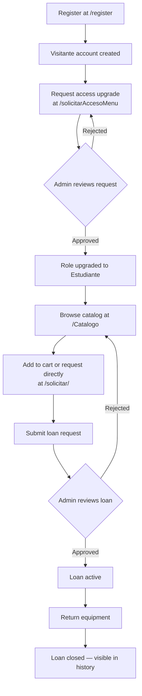

## What is PrestamoEquipo?

PrestamoEquipo is a Flask web application designed to manage the full lifecycle of equipment loans in a Biomedical Engineering lab. Students can discover available equipment through a searchable catalog, submit loan requests with course and professor details, and track the status of their requests from a personal profile page.

Lab administrators get a dedicated dashboard to manage inventory, review and approve incoming requests, oversee active loans, and control user access levels.

<Info>
  PrestamoEquipo connects to a SQL Server database (`sistema_de_prestamo`) via pyodbc. Your institution's database administrator must configure the connection before the system is operational.
</Info>

## Who is it for?

<CardGroup cols={2}>
  <Card title="Students" icon="graduation-cap">
    Browse the equipment catalog, add items to a cart, submit loan requests, and track active and past loans from your profile.
  </Card>
  <Card title="Lab administrators" icon="shield-check">
    Manage inventory and users, approve or reject loan requests, view loan history, and configure access permissions.
  </Card>
</CardGroup>

## Key features

<CardGroup cols={3}>
  <Card title="Equipment catalog" icon="book-open">
    Browse all lab equipment with availability status. Filter by status to find items ready for loan.
  </Card>
  <Card title="Cart and loan requests" icon="shopping-cart">
    Add multiple items to a cart or request equipment directly. Each request captures the reason, dates, professor, and course.
  </Card>
  <Card title="Request tracking" icon="clock">
    Check the current status of every loan request from your personal profile page at `/perfilUsuario`.
  </Card>
  <Card title="Admin dashboard" icon="chart-bar">
    A central view for administrators to monitor all pending requests, active loans, and system activity.
  </Card>
  <Card title="Inventory management" icon="boxes-stacking">
    Add, update, or retire equipment records directly from the admin panel.
  </Card>
  <Card title="User management" icon="users">
    Review registered users, manage access levels, and process access upgrade requests.
  </Card>
</CardGroup>

## Permission levels

PrestamoEquipo uses three role-based permission levels. Every new account starts as a Visitante and must request an upgrade to submit loan requests.

<AccordionGroup>
  <Accordion title="Visitante (Visitor)" icon="eye">
    The default role assigned to all newly registered accounts.

    - Read-only access to the equipment catalog
    - Cannot submit loan requests
    - Can request an access upgrade to become a Estudiante by submitting a reason and an ID document image at `/solicitarAccesoMenu`
  </Accordion>
  <Accordion title="Estudiante (Student)" icon="graduation-cap">
    Granted after an administrator approves an access upgrade request.

    - Full catalog access
    - Can submit loan requests via the cart or directly from an equipment page
    - Can track active and past loans from their profile
  </Accordion>
  <Accordion title="Administrador (Administrator)" icon="shield-check">
    Assigned manually by an existing administrator.

    - All student capabilities
    - Access to the admin dashboard at `/home`
    - Manage inventory, approve or reject loan requests, view full loan history, and manage user roles
  </Accordion>
</AccordionGroup>

<Note>
  An administrator must approve your access upgrade request before you can submit loan requests. Approval times depend on lab staff availability.
</Note>

## System overview

The diagram below shows how a student moves through the system from registration to a completed loan.

## Application structure

The application is organized into three route blueprints, each handling a distinct area of functionality.

<CardGroup cols={3}>
  <Card title="auth_bp" icon="lock">
    Handles login, registration, logout, user profile, and personal loan management. Routes live in `routes/auth_routes.py`.
  </Card>
  <Card title="equipos_bp" icon="boxes-stacking">
    Serves the equipment catalog, cart, and loan request submission. Routes live in `routes/Catalogo_routes.py`.
  </Card>
  <Card title="admin_bp" icon="shield-check">
    Powers the admin dashboard, inventory, user management, approvals, and loan history. Routes live in `routes/admin_routes.py`.
  </Card>
</CardGroup>

## Next steps

<Card title="Quickstart" icon="rocket" href="/quickstart">
  Register an account and submit your first loan request in minutes.
</Card>
