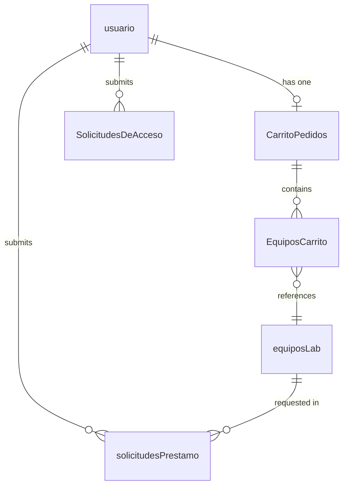

The application connects to a SQL Server Express database named `sistema_de_prestamo` using Windows Trusted Authentication. All queries are issued through `pyodbc` — there is no ORM.

## Tables

### usuario

Stores all registered accounts. The `Permiso` column controls what the user can access throughout the application.

| Column | Type | Description |
|--------|------|-------------|
| `IDusuario` | `INT` (PK) | Auto-incremented user identifier |
| `NombreUsuario` | `NVARCHAR` | First name |
| `Password` | `NVARCHAR` | Werkzeug-hashed password (never plaintext) |
| `Apellido` | `NVARCHAR` | Last name |
| `Carrera` | `NVARCHAR` | Academic program or department |
| `Telefono` | `NVARCHAR` | Contact phone number |
| `Rol` | `NVARCHAR` | Descriptive role label (e.g. "Estudiante") |
| `Email` | `NVARCHAR` | Email address used for contact |
| `Permiso` | `NVARCHAR` | Access level: `'Visitante'`, `'Estudiante'`, or `'Administrador'` |
| `Imagen` | `NVARCHAR` | Path or filename of the profile image |

`Permiso` is the authoritative field checked by `@verificar_permiso`. `Rol` is a display label and is not used for access control.

---

### equiposLab

The equipment catalog. Each row represents one physical item available for loan.

| Column | Type | Description |
|--------|------|-------------|
| `IDequipo` | `INT` (PK) | Auto-incremented equipment identifier |
| `Nombre` | `NVARCHAR` | Equipment name |
| `Descripción` | `NVARCHAR` | General description |
| `Estado` | `NVARCHAR` | Availability status: `'Disponible'` or `'En uso'` |
| `FechaDeAdquisición` | `DATE` | Date the item was acquired |
| `Ubicación` | `NVARCHAR` | Physical storage location |
| `Imagen` | `NVARCHAR` | Path or filename of the equipment image |
| `UltimaActualizacion` | `DATETIME` | Timestamp of the last record update |
| `Tipo` | `NVARCHAR` | Equipment category or type |
| `CI` | `NVARCHAR` | Internal classification code |
| `NumeroDeInventario` | `NVARCHAR` | Institutional inventory number |
| `DescripcionTecnica` | `NVARCHAR` | Detailed technical description |
| `Marca` | `NVARCHAR` | Manufacturer or brand |
| `Modelo` | `NVARCHAR` | Model name or number |
| `NumeroDeSerie` | `NVARCHAR` | Serial number |
| `Mantos_Anuales` | `INT` | Number of annual maintenance services |

---

### solicitudesPrestamo

Records individual loan requests for a single piece of equipment. Created either from the catalog page or when a cart is checked out.

| Column | Type | Description |
|--------|------|-------------|
| `IDsolicitud` | `INT` (PK) | Auto-incremented request identifier |
| `IDequipo` | `INT` (FK → equiposLab) | Equipment being requested |
| `NombreEquipo` | `NVARCHAR` | Denormalized equipment name at time of request |
| `IDusuario` | `INT` (FK → usuario) | User who submitted the request |
| `NombreUsuario` | `NVARCHAR` | Denormalized user name at time of request |
| `FechaSolicitud` | `DATETIME` | When the request was submitted |
| `Motivo` | `NVARCHAR` | Reason provided by the student |
| `FechaInicio` | `DATE` | Requested loan start date |
| `FechaEntrega` | `DATE` | Requested return date |
| `Estado` | `NVARCHAR` | Current state in the loan lifecycle |
| `Profesor` | `NVARCHAR` | Supervising professor name |
| `Materia` | `NVARCHAR` | Course or subject associated with the loan |
| `FechaDeActivacion` | `DATETIME` | When the request was approved or acted upon |
| `FechaDev` | `DATE` | Date the equipment was returned (set when `Estado` becomes `'Concluido'`) |

**Estado values:**

| Value | Meaning |
|-------|---------|
| `'pendiente'` | Submitted, awaiting admin review |
| `'activo'` | Admin approved, equipment is on loan |
| `'Concluido'` | Equipment returned by the student via `/Devolver/<id>` |
| `'eliminado'` | Rejected by admin or closed via admin panel |
| `'cancelado'` | Cancelled by the student before approval |
| `'rechazado'` | Rejected by an admin |

---

### CarritoPedidos

Represents a user's shopping cart. Each user has at most one active cart. The state transitions from `'En Carrito'` to `'Pendiente'` when the student submits all items for review.

| Column | Type | Description |
|--------|------|-------------|
| `CarritoID` | `INT` (PK) | Auto-incremented cart identifier |
| `IDusuario` | `INT` (FK → usuario) | Owner of the cart |
| `estado` | `NVARCHAR` | Cart state: `'En Carrito'` or `'Pendiente'` |

**estado values:**

| Value | Meaning |
|-------|---------|
| `'En Carrito'` | Items are being assembled, not yet submitted |
| `'Pendiente'` | All items submitted as loan requests, awaiting admin review |

---

### EquiposCarrito

Junction table linking cart entries to equipment items. Supports multiple items per cart and a quantity per item.

| Column | Type | Description |
|--------|------|-------------|
| `CarritoID` | `INT` (FK → CarritoPedidos) | Cart this item belongs to |
| `IDequipo` | `INT` (FK → equiposLab) | Equipment item in the cart |
| `quantity` | `INT` | Number of units requested |

The composite of `(CarritoID, IDequipo)` identifies a unique line item.

---

### SolicitudesDeAcceso

Tracks access upgrade requests submitted by visitors who want to become students. Admins review and approve or reject these requests.

| Column | Type | Description |
|--------|------|-------------|
| `IDsolicitudAcceso` | `INT` (PK) | Auto-incremented request identifier |
| `IDusuario` | `INT` (FK → usuario) | Visitor who submitted the request |
| `NombreUsuario` | `NVARCHAR` | Denormalized user name at time of request |
| `Motivo` | `NVARCHAR` | Reason for requesting elevated access |
| `Estado` | `NVARCHAR` | Current review state |
| `FechaDeActivacion` | `DATETIME` | When the request was created or acted upon |

**Estado values:**

| Value | Meaning |
|-------|---------|
| `'Acceso'` | Submitted, awaiting admin review |
| `'Aprobado'` | Admin approved; user `Permiso` set to `'Estudiante'` |
| `'Rechazado'` | Admin rejected the request |

---

## Entity relationships

Key relationship notes:

- **usuario → CarritoPedidos**: One-to-one via `IDusuario`. A user gets one cart at registration. The same `CarritoID` is stored in `session['Carrito_ID']` for fast lookups.
- **CarritoPedidos → EquiposCarrito**: One-to-many via `CarritoID`. Each row in `EquiposCarrito` is one line item.
- **EquiposCarrito → equiposLab**: Many-to-one via `IDequipo`. Multiple carts can reference the same equipment.
- **usuario → solicitudesPrestamo**: One-to-many. A user can have multiple loan requests over time.
- **equiposLab → solicitudesPrestamo**: One-to-many. The same equipment can appear in multiple requests (sequentially, not simultaneously when enforced by `Estado`).
- **usuario → SolicitudesDeAcceso**: One-to-many via `IDusuario`. A visitor may submit multiple access requests.

<Warning>
  Cascade deletes are configured on `observacionesEquipos` (keyed on `idEquipo` and `IDusuario`). Deleting an equipment record or user will automatically remove related observation rows.
</Warning>
